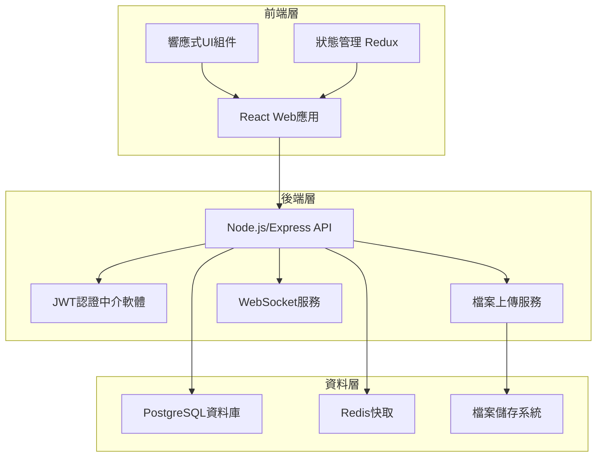
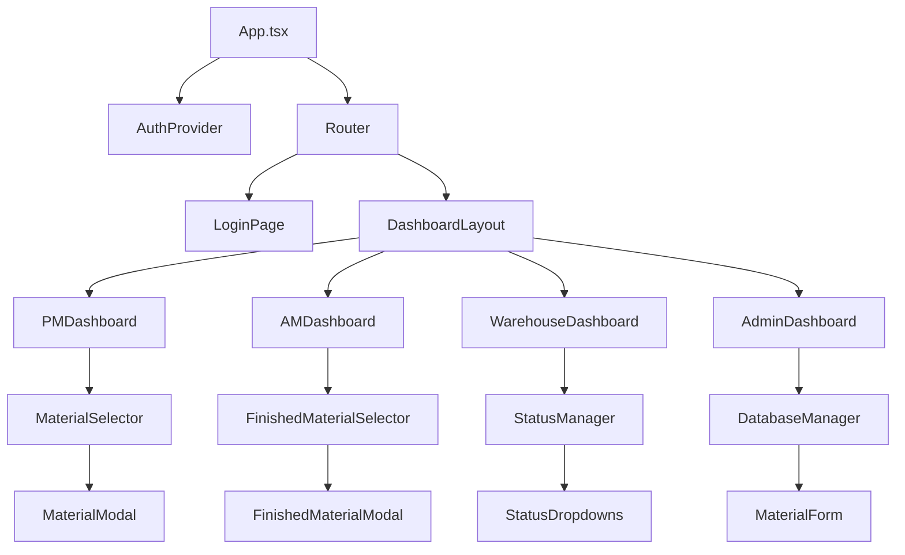
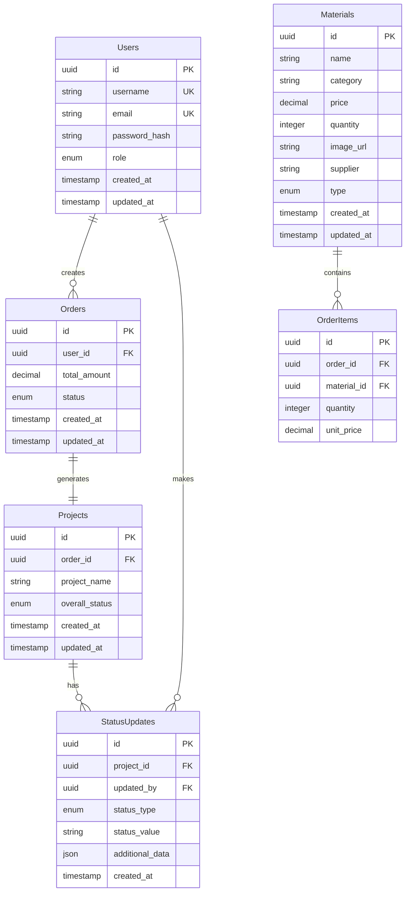

# 設計文件

## 概述

雲水基材管理系統是一個基於Web的多角色物流管理平台，採用現代化的前後端分離架構。系統支援實時狀態更新、圖片管理、權限控制等核心功能，並提供響應式設計以支援多裝置存取。

## 架構

### 系統架構圖



### 技術堆疊

**前端：**
- React 18 + TypeScript
- Redux Toolkit (狀態管理)
- Material-UI (UI組件庫)
- React Router (路由管理)
- Axios (HTTP客戶端)
- Socket.io-client (實時通訊)

**後端：**
- Node.js + Express
- TypeScript
- JWT (身份驗證)
- Multer (檔案上傳)
- Socket.io (WebSocket)
- bcrypt (密碼加密)

**資料庫：**
- PostgreSQL (主資料庫)
- Redis (快取和會話管理)

**部署：**
- Docker容器化
- Nginx反向代理
- PM2程序管理

## 組件和介面

### 前端組件架構



### 核心組件設計

#### 1. MaterialSelector 組件
```typescript
interface MaterialSelectorProps {
  userType: 'PM' | 'AM';
  onOrderCreate: (order: Order) => void;
}

interface Material {
  id: string;
  name: string;
  category: string;
  price: number;
  quantity: number;
  image: string;
  supplier?: string; // 僅完成材使用
}
```

#### 2. StatusManager 組件
```typescript
interface StatusManagerProps {
  projectId: string;
  currentStatus: ProjectStatus;
  onStatusUpdate: (status: StatusUpdate) => void;
}

interface ProjectStatus {
  orderStatus: OrderStatus;
  pickupStatus: PickupStatus;
  deliveryStatus: DeliveryStatus;
  checkStatus: CheckStatus;
}
```

#### 3. DatabaseManager 組件
```typescript
interface DatabaseManagerProps {
  onMaterialCreate: (material: Material) => void;
  onMaterialUpdate: (id: string, material: Partial<Material>) => void;
  onMaterialDelete: (id: string) => void;
}
```

### API端點設計

#### 認證相關
```
POST /api/auth/login
POST /api/auth/logout
POST /api/auth/refresh
GET  /api/auth/profile
```

#### 使用者管理
```
POST /api/users (僅管理員)
GET  /api/users (僅管理員)
PUT  /api/users/:id (僅管理員)
DELETE /api/users/:id (僅管理員)
```

#### 材料管理
```
GET  /api/materials?type=auxiliary|finished
POST /api/materials (僅管理員)
PUT  /api/materials/:id (僅管理員)
DELETE /api/materials/:id (僅管理員)
POST /api/materials/:id/image (僅管理員)
```

#### 訂單管理
```
POST /api/orders
GET  /api/orders
GET  /api/orders/:id
PUT  /api/orders/:id/status (僅倉庫管理員)
```

#### 專案管理
```
GET  /api/projects
GET  /api/projects/:id
PUT  /api/projects/:id/status (僅倉庫管理員)
```

## 資料模型

### 資料庫架構



### 資料模型定義

#### User Model
```typescript
interface User {
  id: string;
  username: string;
  email: string;
  role: 'PM' | 'AM' | 'WAREHOUSE' | 'ADMIN';
  createdAt: Date;
  updatedAt: Date;
}
```

#### Material Model
```typescript
interface Material {
  id: string;
  name: string;
  category: string;
  price: number;
  quantity: number;
  imageUrl: string;
  supplier?: string;
  type: 'AUXILIARY' | 'FINISHED';
  createdAt: Date;
  updatedAt: Date;
}
```

#### Project Model
```typescript
interface Project {
  id: string;
  orderId: string;
  projectName: string;
  overallStatus: 'ACTIVE' | 'COMPLETED' | 'CANCELLED';
  statusHistory: StatusUpdate[];
  createdAt: Date;
  updatedAt: Date;
}
```

#### StatusUpdate Model
```typescript
interface StatusUpdate {
  id: string;
  projectId: string;
  updatedBy: string;
  statusType: 'ORDER' | 'PICKUP' | 'DELIVERY' | 'CHECK';
  statusValue: string;
  additionalData?: {
    time?: string;
    address?: string;
    po?: string;
    deliveredBy?: string;
  };
  createdAt: Date;
}
```

## 錯誤處理

### 前端錯誤處理策略

1. **網路錯誤**
   - 自動重試機制
   - 離線狀態檢測
   - 使用者友善的錯誤訊息

2. **驗證錯誤**
   - 即時表單驗證
   - 清晰的錯誤提示
   - 防止重複提交

3. **權限錯誤**
   - 自動重新導向到登入頁面
   - 清楚的權限不足提示

### 後端錯誤處理策略

1. **全域錯誤處理中介軟體**
```typescript
interface ApiError {
  statusCode: number;
  message: string;
  code: string;
  details?: any;
}
```

2. **資料庫錯誤處理**
   - 連線池管理
   - 交易回滾機制
   - 資料完整性檢查

3. **檔案上傳錯誤處理**
   - 檔案大小限制
   - 檔案類型驗證
   - 儲存空間檢查

## 測試策略

### 前端測試

1. **單元測試**
   - Jest + React Testing Library
   - 組件邏輯測試
   - Redux狀態管理測試

2. **整合測試**
   - API整合測試
   - 使用者流程測試

3. **端到端測試**
   - Cypress自動化測試
   - 關鍵業務流程驗證

### 後端測試

1. **單元測試**
   - Jest測試框架
   - 服務層邏輯測試
   - 資料模型驗證測試

2. **API測試**
   - Supertest HTTP測試
   - 端點功能驗證
   - 權限控制測試

3. **資料庫測試**
   - 測試資料庫隔離
   - 資料遷移測試
   - 效能測試

### 安全性考量

1. **身份驗證與授權**
   - JWT Token安全實作
   - 角色權限控制
   - 會話管理

2. **資料保護**
   - 密碼加密儲存
   - SQL注入防護
   - XSS攻擊防護

3. **檔案上傳安全**
   - 檔案類型白名單
   - 檔案大小限制
   - 惡意檔案掃描

4. **API安全**
   - 請求頻率限制
   - CORS設定
   - HTTPS強制使用